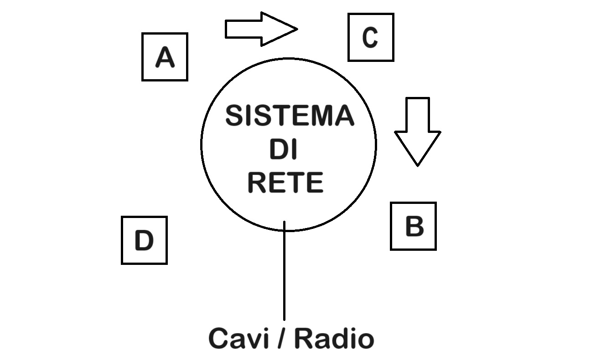

# APPUNTI DEL CORSO _RETI DI CALCOLATORI_ DEL CORSO DI INFORMATICA (UNIMI)

## Indice
[Lezione 1 - Introduzione](#lezione-1---introduzione)

### LEZIONE 1 - INTRODUZIONE
Per prima cosa va introdotto il concetto di **_rete_**: sistema distribuito di computer.  

A, B, C e D sono macchine distribuite geograficamente e non necessariamente connesse fra di loro, ma interconnettibili attraverso un **sistema di rete**.  

#### Cosa fa un sistema di rete:
un sistema di rete crea i canali che consentono ad un calcolatore di entrare in connessione con un server per effettuare operazioni come lo scambio di file.  
Per creare questo sistema di rete bisogna capire cosa aggiungere al **sistema operativo** di ogni macchina.  

Un sistema di rete è possibile considerarlo come un vero e proprio grafo e i suoi nodi sono i cosiddetti **apparati di rete**.  
