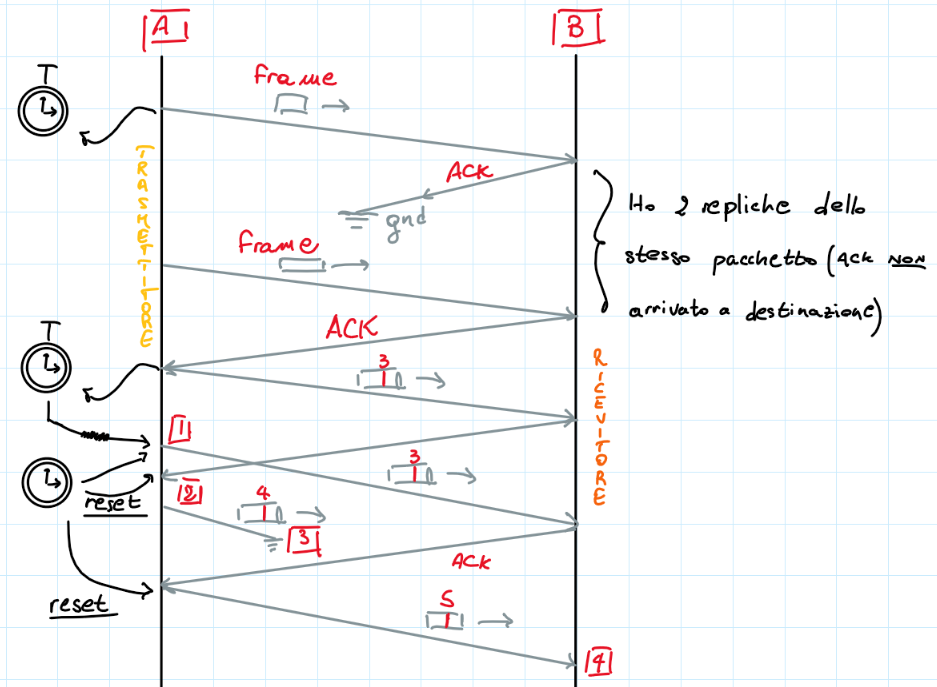

# APPUNTI DEL CORSO _RETI DI CALCOLATORI_ DEL CORSO DI INFORMATICA (UNIMI)

## Indice
- [Lezione 1 - Introduzione](#lezione-1---introduzione)  
- [Lezione 2](#lezione-2)
    - [Introduzione ai router](#introduzione-ai-router)
    - [Il concetto di pacchetto](#il-concetto-di-pacchetto)
- [Lezione 3](#lezione-3)
    - [Reti Best-Effort e Connection Oriented](#reti-best-effort-e-connection-oriented)
    - [Approfondimento sulle reti Best-Effort](#approfondimento-sulle-best-effort)
    - [I livelli funzionali](#i-livelli-funzionali)
- [Lezione 4](#lezione-4)
    - [Il concetto di Framing](#il-concetto-di-framing)
    - [Il protocollo HDLC](#il-protocollo-hdlc)
    - [Affidabilità di un protocollo di livello 2](#affidabilità-di-un-protocollo-di-livello-2)

### LEZIONE 1 - INTRODUZIONE
Per prima cosa va introdotto il concetto di **_rete_**: sistema distribuito di computer.  

A, B, C e D sono macchine distribuite geograficamente e non necessariamente connesse fra di loro, ma interconnettibili attraverso un **sistema di rete**.  

#### Cosa fa un sistema di rete:
un sistema di rete crea i canali che consentono ad un calcolatore di entrare in connessione con un server per effettuare operazioni come lo scambio di file.  
Per creare questo sistema di rete bisogna capire cosa aggiungere al **sistema operativo** di ogni macchina.  

Un sistema di rete è possibile considerarlo come un vero e proprio grafo e i suoi nodi sono i cosiddetti **apparati di rete**.  

Tutto ciò che interagisce con l'utente finale fa riferimento ad un host computer.  

Un dispositivo molto importante che vedremo durante il corso è il **router**, che sono apparati dedicati a svolgere solo funzioni di rete. 

### LEZIONE 2
#### Introduzione ai router
**_HOP_ -->** "Salto". Si tratta di un passaggio un nodo ad un altro. Ogni hop ha un costo, poiché la trasmissione ha bisogno di tempo per essere attuata.  

Vediamo l'interno di un **router**:

Il collegamento fra una porta del router e un dispositivo connesso è chiamato ***link di ingresso/uscita**. Essi hanno dei **buffer** gestiti esattamente come delle code.  
Sono i dati all'interno dei buffer che necessitano della gestione da parte dell'**interprete** e conseguentemente anche delle **tabelle di routing**, capendo quindi qual è la porta associata al canale verso il mandare il pacchetto.

I router rappresentano un vero e proprio collo di bottiglia per quanto riguarda le reti internet, anche se in passato era rappresentato proprio dai link di ingresso/uscita.  

I router non fanno altro che decidere il cammino delle informazioni lungo la rete, ma questa decisione può essere presa in più di un modo.  
Nelle situazioni più semplici, la metrica è il numero di nodi, mentre nelle situazioni più "raffinate" è necessario che venga considerato anche il *tempo* come discriminante.  

> Definiamo $T_x$ la velocità di trasmissione di un **link**.  

Supponiamo di avere 2 nodi, che chiamiammo $N_1$ e $N_2$, connessi da un canale di comunicazione a 1 MegaBit al secondo (*Mbps*), ovvero 1000000 *bit al secondo*.  
I 2 nodi rappresentano le rispettive **_sottoreti_** dei 2 calcolatori.  
Ecco una rappresentazione grafica:

Semplificando, un impulso elettrico di *5V* equivale al segnale di *1*, mentre quello di *0V* equivale a quello di *0*.

> **Quesito:** se voglio passare un'informazione di 1000 *bit* su questo canale (su cui può passare 1*Mbps*), cosa ci interessa sapere?  
È necessario conoscere il **_tempo necessario_** alla porta *I/O* per trasmettere il numero di *bit* specificato. Ci viene in supporto un calcolo:  
$T_x = \frac{info_{da inviare}}{capacità_{canale}} = \frac{1000 bit}{1000000 bps} = \frac{10^3 bit} {10^6 bit} = 10^{-3} bps = 1 ms $  

#### Il concetto di pacchetto
Supponiamo di voler scambiare tra due **host** *A* e *B* un file di dimensione di 1 *Mb*.  
Non è ragionevole inviare il contenuto dell'intero file all'interno della sottorete, poiché ogni router si può trovare dinanzi ad una dimensione potenzialmente enorme di dati rischiando un **_overflow_** in pochissimi *millisecondi*.  
La soluzione più sensata in questo caso sarebbe quella di prendere l'intero file, frammentarlo e trasmettere da *A* a *B* un frammento alla volta: ecco che prende piede il concetto di **_pacchetto_**.  

In rete non passa quindi l'intero file, ma solo i frammenti necessari per poi costruire, a fine trasmissione, il tutto; i pacchetti trasmessi sono vere e proprie *unità dati*, che devono rispettare delle regole ben precise per garantire una trasmissione sicura.  

Il pacchetto è suddiviso in 2 parti fondamentali:  

L'*host di provenienza* del pacchetto si occupa chiaramente della frammentazione del file da trasmettere, mentre l'*host di destinazione* si occupa di riassemblare tutti i pacchetti per avere a disposizione il file originale.  

Ovviamente quest'operazione deve essere sicura, nel senso che tutti i dati da trasmettere devono correttametne arrivare a destinazione. Questo aspetto è garantito da 3 fattori:  
1. Il $1^o$ fattore garantisce che i pacchetti vengano ricevuti nell'ordine corretto;  
2. Il $2^o$ fattore garantisce che i pacchetti arrivati non presentino duplicati. Potremmo, ad esempio, introdurre una funzione adibita al controllo di correttezza di una certa sequenza di bit, imponendone inoltre la ritrasmissione nel caso in cui qualcosa fosse andato storto;  
3. Il $3^o$ fattore garantisce l'effettiva correttezza del pacchetto arrivato a destinazione.  

### LEZIONE 3
La creazione di un'architettura funzionale di una rete di calcolatori è un lavoro molto complicato a causa del fatto che questa definizione debba diventare uno **_standard_**.  
La complicazione nel progettare un sistema di rete è infatti rappresentata dal fatto che si debba specificare uno o più algoritmi da utilizzare in una serie di regole che tutti i componenti sono disposti ad accettare: il **_protocollo_**.  

#### Reti Best-Effort e Connection-Oriented
Le connessioni **_Best-Effort_** sono i tipi di connessioni più diffuse (come ad esempio _internet_) e sono progettate per garantire al massimo l'affidabilità durante la trasmissione del pacchetto da mittente a destinatario, anche se questo non è sempre garantito al 100%.  
Proprio per questo motivo deriva il nome _"Best Effort"_, ovvero che garantiscono il _"massimo sforzo"_ per funzionare al meglio, ma non necessariamente sono in grado di garantire l'affidabilità completa dal sistema di comunicazione.  

Esiste un altro tipo di connessioni chiamate **_Connection-Oriented_**, che come si può facilmente intuire sono orientate alla connessione e viene utilizzato un protocollo di comunicazione per stabilire la connessione fra un host *A* ed un host *B*.  

>Da ora in poi, per comodità, chiameremo **_S_** la **_Sorgente_** e **_D_** la **_Destinazione_** del singolo pacchetto da inviare e ricevere.  

#### Approfondimento sulle Best-Effort
Le connessioni *Best-Effort*, oltre ad essere quelle più diffuse, sono generalmente abbastanza affidabili e funzionano mediamente bene: dal punto di vista delle probabilità è molto difficile che avvenga un errore e, allo stesso tempo, viene garantita una certa efficienza in termini di tempo.  
Come detto in precedenza, però, è importante ribadire che non garantiscono il corretto arrivo dei pacchetti anche se fanno del _"loro meglio"_, ma al contrario non sono in grado di garantire neanche che i pacchetti arrivino nello stesso ordine con cui sono stati inviati o che non vi siano duplicati dello stesso pacchetto.  

>Introduciamo a questo punto una nuova grandezza che misura il tempo finito che intercorre dal momento in cui si immette il pacchetto in rete al momento in cui il destinatario lo riceve: $\Delta t$.  
Supponiamo adesso che **S** mandi a **D** una sequenza di pacchetti, ipotizzando che i nodi $N_1$ e $N_2$ facciano parte della *sottorete*, e che impieghi $\Delta t$ per trasmettere un solo pacchetto.  
Va però sottolineato che all'interno del valor di $\Delta t$ vi sono a sua volta altri valori: il tempo che serve a **S** per immettere in rete il pacchetto, il tempo di cui si necessita per farlo arrivare al router d'ingresso nella rete $N_1$ e che lo manderà ad $N_2$ e infine il tempo che serve proprio a $N_2$ per inviare il pacchetto a **S**.  

Riassumendo, se io volessi inviare 4 pacchetti, avrei:
- $\Delta t_0$ **-->** Tempo necessario affinché il primo pacchetto arrivi a destinazione.  
**. . .**
- $\Delta t_3$ **-->** Tempo necessario affinché il primo pacchetto arrivi a destinazione, il tutto dopo un tempo $\Delta t_3$ (a sua volta dopo un tempo $\Delta t_2$ e così via...).  

Nonostante tutti i $\Delta T$ riguardino i medesimi nodi sorgente e destinazione all'interno della rete, non sono uguali, ma esiste una **_varianza_** sul ritardo dovuta, ad esempio, al carico di lavoro dei nodi: il **_JITTER_**.  
Da notare in particolare che il **_jitter_** non è quasi mai costante, ma variabile.  

Ecco una rappresentazione grafica per capirne appieno il concetto:  

A questo punto è facile intuire che i pacchetti, per essere riassemblati dall'host **D**, hanno necessariamente bisogno di un *numero di sequenza* del pacchetto stesso, che si trova all'interno dell'header.  

Studiamo una casistica più complicata: supponiamo di voler inviare in rete e riprodurre un tipo di file *multimediale* come, ad esempio, un file audio (come peraltro avviene oggigiorno in rete con i contenuti in streaming).  
Fin da subito è possibile individuare il problema maggiore: per quanto riguarda la voce è assolutamente necessario campionare il segnale e, per il [teorema di Nyquist-Shannon](https://it.wikipedia.org/wiki/Teorema_del_campionamento_di_Nyquist-Shannon), lo dovrei fare almeno 8000 volte al secondo per non perdere troppo *contenuto informativo*.  
Facendo un paio di conti, se raccolgo 8000 campioni della voce, devo trasmettere ogni 125 $\mu s$ e questo vincolo deve obbligatoriamente essere rispettato.  

A questo punto però si pone una questione: com'è possibile gestire l'invio ripetuto ed in un lasso di tempo così ridotto con il **_jitter_**?  
Idealmente dovrei garantire che il **_jitter_** non ci sia, in modo tale che non vi sia il rischio di avere una ricezione di qualità non equivalente a quella della sorgente.  

>**Soluzione: _Buffer di PlayOut_**  
Ogni nodo di destinazione è dotato di un buffer apposito per riuscire a compensare le varianze sul ritardo.  
Sostanzialmente questo buffer viene utilizzato in modo tale da immagazzinare pacchetti audio all'interno di applicazioni interattive _real-time_,

La comunicazione multimediale è infatti molto tollerante per quanto riguarda gli errori e un eventuale perdita di un frammento che compone la comunicazione non inficia sulla qualità generale della stessa.  

**CONCLUSIONE: i parametri di rete necessari sono:**  
- Tempo di **_Trasmissione_** $T_x$;
- Tempo di **_Propagazione_** $T_p$;
- Il **_Jitter_** $J_{it}$;
- La **_probabilità d'errore_** $P_{err}$;  

Tutte queste componenti non fanno altro che aumentare il valore della **_latenza_**, ovvero il tempo da aspettare per ricevere o inviare un contenuto in rete.  

**Osservazione sulla probabilità d'errore:** al giorno d'oggi il valore $P_{link}$ di probabilità di errore dei link è nell'ordine di $10^7 | 10^9$, mentre quello relativo al valore $P_{pack}$ dei pacchetti nell'ordine di $\frac{10^3}{10^9} = 10^{-6}$.  
I link, in particolare, sono più affidabili nel momento in cui si parta di reti in *fibra*, mentre lo sono meno per quanto riguarda le reti *mobili* e *radio*.  

#### I livelli funzionali
I livelli funzionali di rete è possibile rappresentarli nel seguente modo:  

- Livello **_Application_**: Funzionalità di rete che supportano gli utenti finali (ad esempio il protocollo *hhttp*);
- Livello **_Transport_**: *end-to-end*, gli interlocutori sono gli host. I protocolli di questo layer sono il **_TCP_** (che garantisce affidabilità) e l'**_UDP_** (che, al contrario, garantisce buone prestazioni _real-time_, è maggiormente veloce, ma è al contempo meno affidabile e non gestisce in alcun modo la ridondanza dei pacchetti e la loro perdita durante il corso della trasmissione).  
- Livello **_Network_**: contiene tutte le funzioni di **instradamento** (*Packet Tracer* è un software che si occupa della simulazione di questa funzionalità).  
- Livello **_Data-Link_**: contiene le unità dati, i **frame**. Garantisce **affidabilità**.  
- Livello **Physics**: si occupa della **trasmissione e ricezione**. Si occupa di ricevere ed inviare bit a bit, che possono essere ricevuti da uno strato fisico da un altro router per poi essere re-inviati al buffer dello strato *Data-Link*.  

>**NB:** le entità dello stesso livello dialogano fra di loro, grazie ai **protocolli**.  
In sintesi, possiamo affermare che per il *dialogo orizzontale* ci si avvale dei **protocolli**, mentre per quanto riguarda il *dialogo verticale* ci si avvale dell'**implementazione**.  

>**OSSERVAZIONE:** Le **_socket_** non sono un vero e proprio livello, ma sono funzioni del *Sistema Operativo* che creano [*binding*](https://it.wikipedia.org/wiki/Binding#:~:text=In%20informatica%20il%20binding%20%C3%A8,ed%20il%20suo%20corrispettivo%20valore.) tra un processo ed il processo remoto con cui sta comunicando.

### LEZIONE 4

#### Il concetto di Framing

Nella lezione precedente abbiamo fatto una distinzione fra le connessioni **_Best Effort_** e quelle **_Connection Oriented_**.  
Di ciò che era stato detto, ricordiamo in particolar modo che le prime non sono affidabili, mentre le altre sì.  

Analizziamo la seguente figura:  

Da qui nasce un **problema**: il **_framing_**.  
Il **_frame_** è una sequenza di _bit_ provenienti dai livelli superiori.  

Il nodo **_B_** cercherà di ricevere i bit trasmessi sincronizzando il suo _clock_  di ricezione con quello di trasmissione di **_A_**.  
Ciò che bisogna capire è quindi come fa **_A_** a far capire a **_B_** che sta iniziando a trasmettere dei bit e a fargli anche capire quando questa trasmissione ha fine.  

**SOLUZIONE:** definire una sorta di _trigger_.

> **NB**: nel momento in cui vi è uno stato di **NON trasmissione**, ci si trova in quello che viene chiamato **_stato di IDLE_** e vengono trasmessi una serie di *1*.  

#### Il protocollo HDLC

**_HDLC_** sta per:  
High-Level  
Data  
Link  
Control  

Analizziamo il seguente schema:  

Le **_flag_** di inizio e fine devono per forza contenere almeno uno *0* e vengono incapsulate all'interno del **_frame_**; inoltre è **fondamentale** che nella parte di **_unità dati_ NON** vi sia una stringa di *bit* uguale alla **_flag_** per evitare eventuali perdite di dati.  

Dopo la **_flag_**, viene salvato un *bit* alla volta all'interno di un *buffer*; attraverso una **maschera** (ovvero una finestra di scorrimento di 8 *bit*), dopo ogni *bit*, viene controllato se la sequenza ricevuta corrisponde alla **_flag_**.  

> **SOLUZIONE:** si aggiungono degli zeri, ovvero dei **_bit di controllo_** dopo cinque *1* di fila.  
Questo procedimento prende il nome di **_bit stuffing_**.  

> Ricapitolando:
Il **trasmettitore** aggiunge sempre uno *0* dopo 5 *1* a livello **fisico**.  
Il **ricevitore**, dopo 5 *1*, estrae il *bit* successivo (nel caso in cui fosse *0* lo butto via e continuo a leggere, mentre se è *1* mi fermo) e lo posiziona all'interno di un *buffer*.  

#### Affidabilità di un protocollo di livello 2

Supponiamo che venga perso un pacchetto (*frame*) per comprendere meglio l'utilità del numero di sequenza:

Per prima cosa, noto che, nel momento in cui al punto **_B_** vengono inviati 2 pacchetti uguali è possibile notarlo proprio perché ho il medesimo numero di sequenza, ma non solo: ho anche 2 variabili fondamentali.  

> **Variabile Invio (o "Send")**: contatore incrementato se e solo se si riceve l'**_ACK_** corrispondente.  
**Variabile Ricezione**: valore che indica il numero progressivo del pacchetto che ci si aspetta di ricevere; nel momento in cui non fosse così, il pacchetto viene scartato.  

Analizziamo ora i punti numerati del disegno:  
1. Il **_CLK_** scade e, a questo punto, il pacchetto viene iniviato nuovamente;  
2. L'**_ACK_** viene ricevuto in ritardo e conseguentemente il quarto pacchetto può essere inviato;  
3. Il quarto pacchetto si interrompe durante l'invio, di conseguenza il ricevitore manda un **_ACK_** per *resettare* il timer e reinviare il quarto pacchetto mai arrivato;  
4. A questo punto viene inviato il quinto pacchetto che verrà ricevuto correttamente (anche se il quarto pacchetto, come si evince dal disegno, è stato perso).  

Non essendo più in grado di trasmettere il pacchetto 4, il **trasmettitore** elimina la sua copia nel buffer di ri-trasmissione.  

> **SOLUZIONE:** Anche nell'**_ACK_** viene aggiunto il numero di sequenza per ogni frame corrispondente.  

> **CONCLUSIONE:** per avere a disposizione una base per un protocollo affidabile di **livello 2**, necessitiamo di:  
**1-** *Timer*  
**2-** Buffer di *ri-trasmissione*  
**3-** Variabile di *Send*  
**4-** Variabile di *Ricezione*  
**5-** Numero di sequenza di *pacchetto* e *ACK*  

#### RTT e tempi di propagazione

> **Definizione di RTT:** _Round Trip Time_, ovvero il tempo che intercorre fra l'invio di un segnale e la ricezione della conferma di arrivo dello stesso.

> $Domanda^1$: quanto pesa il tempo di propagazione e quanto quello di trasmissione sul **_RTT_**?  
Dipende dalle caratteristiche tecnologiche del sistema.

> $Domanda^2$: perché nella formula del **_RTT_** conto per 2 volte il **tempo di propagazione**, ma solo 1 volta il **tempo di trasmissione**?  
Se osserviamo lo schema, infatti, dopo aver inviato correttamente un **frame** ci si aspetta in tutta risposta l'arrivo di un **ACK**, il cui *tempo di trasmissione* dovrebbe essere contato. Il punto della questione sta nel fatto che questo tempo è rappresentato da un valore talmente piccolo che **può essere trascurato**.  

Nel primo caso la maggior parte del **_RTT_** è occupata dalla trasmissione del pacchetto e non è possibile fare altro.  
Nel secondo caso, in cui $2T_p > T_x$, è possibile aumentare l'efficienza della **porta I/O** (è infatti possibile mandare più frame prima di ricevere l'**ACK**).  

A questo punto è possibile introdurre un nuovo parametro di prestazione: l'**_utilizzo del canale_**.  

> **Formula**: $U = \frac{T_x}{RTT}$  
Più questo valore tende a *1*, maggiore è l'efficienza.  

Se ho i seguenti 2 casi:  
1. $U = \frac{0,1}{0,12} = 0,83$ --> Utilizzo del canale all'**80%**  
2. $U' = \frac{0,1}{0,3} = 0,33$ --> Utilizzo del canale all'**30%**  

Come faccio a **massimizzare** questo caso? Idealmente dovrei inviare 3 frame in *parallelo* (poiché $0,33 * 3 = 1$).  

> **OSSERVAZIONE:** Devo svincolarmi dalla situazione vista finora; detto in altre parole, non devo aver più bisogno di trasmettere l'**ACK** per trasmettere un nuovo **frame**, ma devo trasmettere una vera e propria **_finestra di frame_**.  
**FORMULA**: $U = K * \frac{t_x}{t_x + 2T_p}$ dove **_K_** è la dimensione della finestra di $T_x$.  

Ecco come funziona la finestra di frame:  

